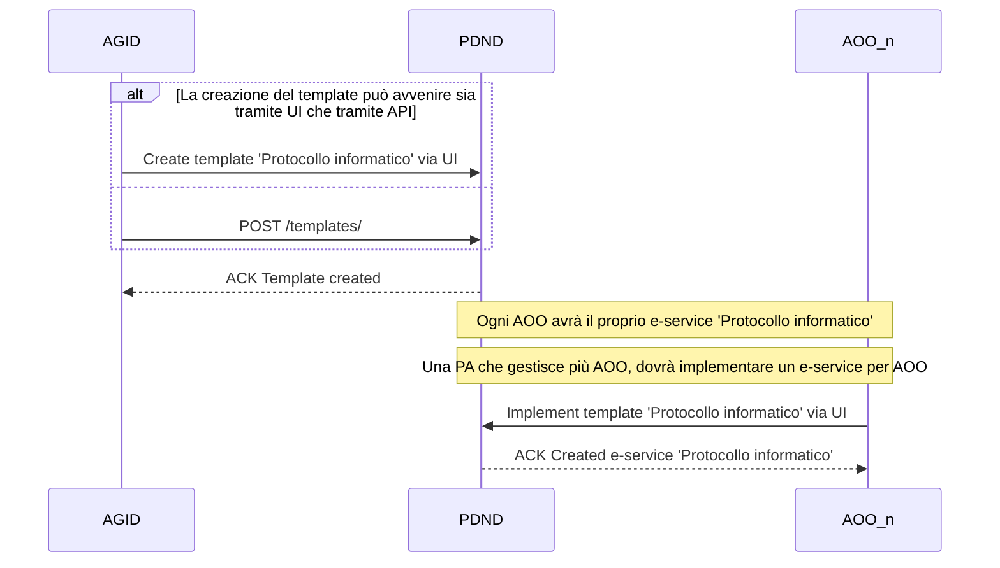
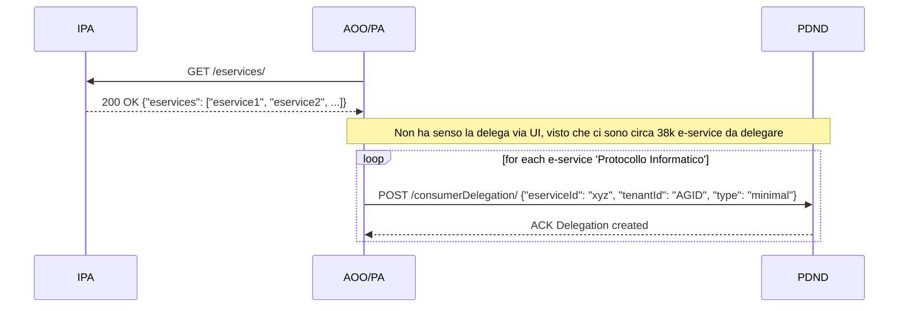
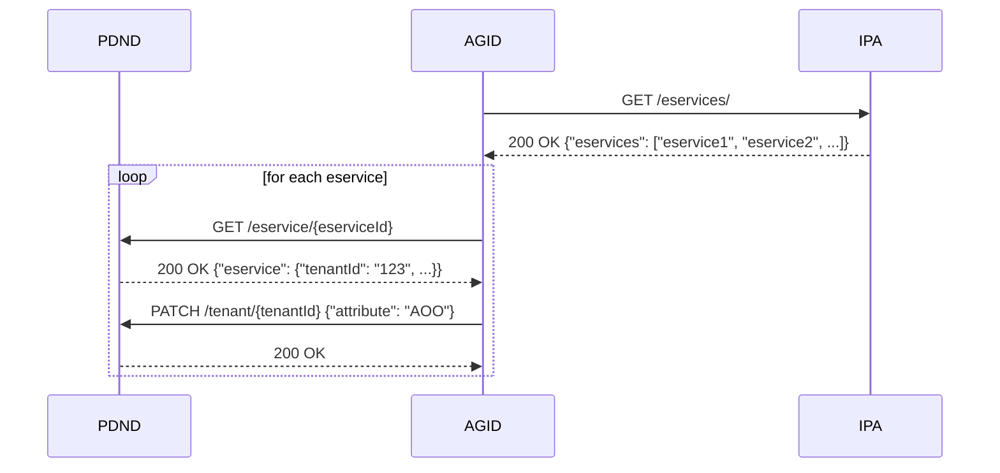
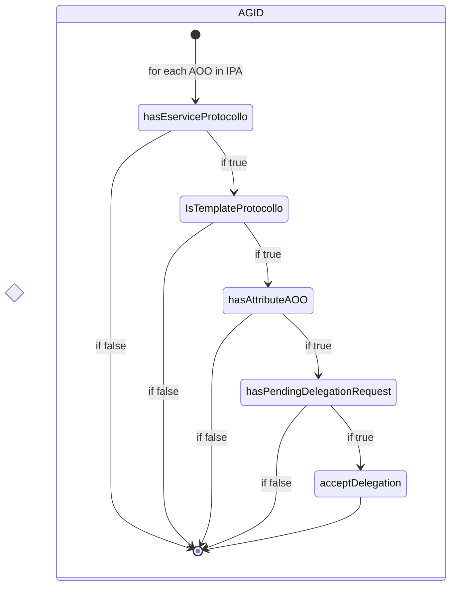
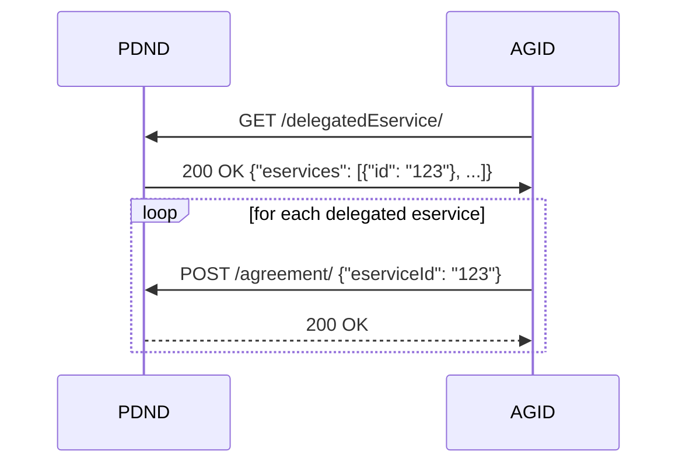
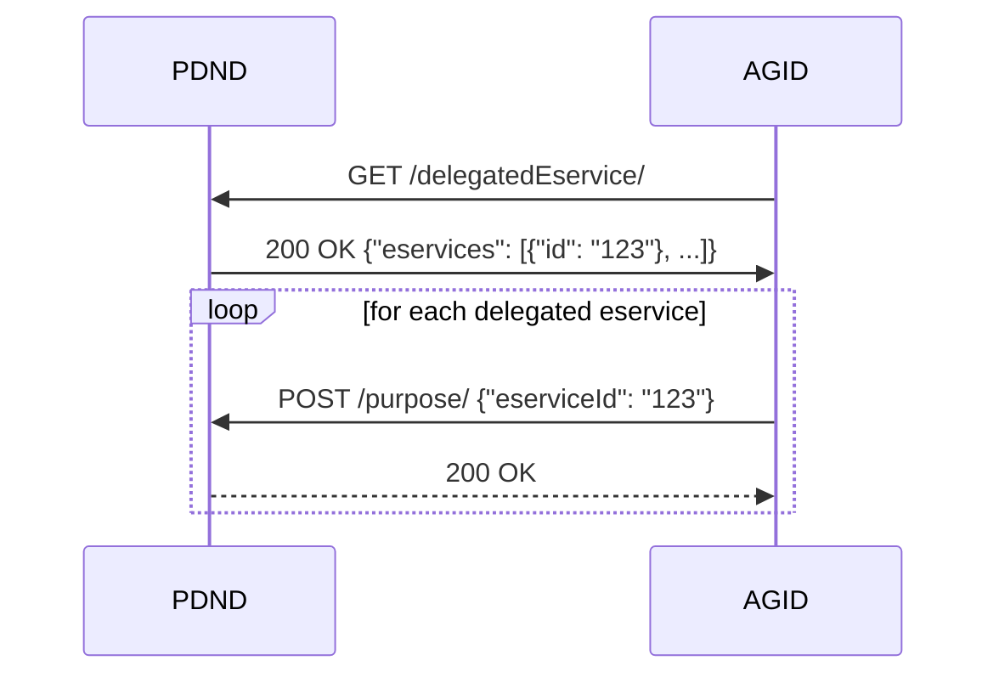

# Software Requirements Specification
## For Protocollo Informatico

Version 0.1  
Prepared by [@andreamisuraca](https://www.github.com/andreamisuraca), [@iamsimone](https://www.github.com/iamsimone)  
Dipartimento per la trasformazione digitale / AGID  
Created 2025-03-17  

Table of Contents
=================
* [Storia Revisione](#storia-revisione)
* 1 [Introduzione](#1-introduzione)
  * 1.1 [Scopo del Documento](#11-scopo-del-documento)
  * 1.2 [Scopo del Prodotto](#12-scopo-del-prodotto)
  * 1.3 [Definizioni, Acronimi e Abbreviazioni](#13-definizioni-acronomi-e-abbreviazioni)
  * 1.4 [Riferimenti](#14-riferimenti)
  * 1.5 [Panoramica del Documento](#15-panoramica-del-documento)
* 2 [Panoramica del Prodotto](#2-panoramica-del-prodotto)
  * 2.1 [Prospettiva del Prodotto](#21-prospettiva-del-prodotto)
  * 2.2 [Funzionalità del Prodotto](#22-funzionalità-del-prodotto)
  * 2.3 [Vincoli del Prodotto](#23-vincoli-del-prodotto)
  * 2.4 [Assunzioni e Dipendenze](#24-assunzioni-e-dipendenze)
* 3 [Requisiti](#3-requisiti)
  * 3.1 [Interfacce Esterne](#31-interfacce-esterne)
  * 3.2 [Funzionali](#32-funzionali)
    * 3.2.1 [Onboarding PDND](#321-onboarding-pdnd)
    * 3.2.2 [Creazione del template](#322-creazione-del-template)
    * 3.2.3 [Delega fruizione](#323-delega-fruizione)
    * 3.2.4 [Registrazione degli e-service](#324-registrazione-degli-e-service)
    * 3.2.5 [Assegnazione attributo AOO](#325-assegnazione-attributo-aoo)
    * 3.2.6 [Verifiche AgID](#326-verifiche-agid)
    * 3.2.7 [Invio richieste di fruizione](#327-invio-richieste-di-fruizione)
    * 3.2.8 [Gestione delle finalità](#328-gestione-delle-finalità)
* 4 [Appendici](#4-appendici)

## Storia Revisione
| Nome | Data    | Motivo dei cambiamenti  | Versione   |
| ---- | ------- | ------------------- | --------- |
| Andrea Misuraca | 2025-03-17 | Stestura iniziale | 0.1 |
|      |         |                     |           |
|      |         |                     |           |

## 1. Introduzione
> Il documento descrive il caso d'uso del protocollo informatico, cioè lo scambio di documenti protocollati tra amministrazioni pubbliche tramite API REST.

### 1.1 Scopo del Documento
Lo scopo del documento è di definire le funzionalità in PDND necessarie per l'utilizzo del protocollo informatico. Serve inoltre d'aiuto per la stesura delle Linee Guida AgID relative al protocollo.

### 1.2 Scopo del Prodotto
Il “Sistema di Gestione Informatica dei Documenti” è utilizzato da una Pubbliche Amministrazioni per gestire il ciclo di vita dei “Documenti Amministrativi Informatici”, a partire dalla loro formazione/ricezione per giungere alla loro archiviazione e/o
trasmissione.
Con “Protocollo Informatico” si indica la componente software del sistema di gestione informatica dei documenti che assicura la gestione contemporanea della registrazione di protocollo e segnatura di protocollo.
In particolare si vuole normale la trasmissione e la ricezione dei documenti informatici, mediante standard web sicuri ed affidabili, nel rispetto delle Linee Guida AgID per l'interoperabilità (ModI) e per la Piattaforma Digitale Nazionale Dati.

### 1.3 Definizioni, Acronimi e Abbreviazioni
@todo:{AnMi: TBD}

### 1.4 Riferimenti
* Linee Guida AgID per l'interoperabilità (ModI)
* Linee Guida AgID per il documento informatico
* Linee Guida AgID per la PDND

### 1.5 Panoramica del Documento
Il capitolo successivo offre una visione d'insieme, ad alto livello, del software che si intende realizzare. È seguito poi da un capitolo più tecnico in cui vengono esplicitati i requisiti funzionali e viene descritta l'architettura da implementare.

## 2. Panoramica del Prodotto
> La sezione descrive in maniera generica e ad alto livello il software, in modo da fornire un contesto e adeguate giustificazioni per le scelte adottate.

### 2.1 Prospettiva del Prodotto
L'esigenza nasce dal fatto che le Pubbliche Amministrazioni hanno la necessità di scambiarsi documenti protocollati in maniera efficiente. Attualmente sono previsti protocolli di comunicazioni, basati su interfacce SOAP, che complicano le modalità di trasmissione dei documenti. Inoltre, molte amministrazioni utilizzano ancora le PEC come strumento di comunicazione. In quest'ottica, queste specifiche vogliono essere un punto di partenza per le future Linee Guida AgID, in modo da fornire un'alternativa valida rispetto agli attuali mezzi.

### 2.2 Funzionalità del Prodotto
Alla base del presente documento c'è l'idea di rendere interoperabili le amministrazioni. L'infrastruttura d'interoperabilità sfrutta oggi la PDND. Le amministrazioni possono così procedere all'adesione nella piattaforma ed esporre e fruire di e-service. Uno degli e-service che si chiederà di esporre è proprio il protocollo informatico. Il servizio consentirà la trasmissione e la ricezione dei documenti protocollati. Tuttavia, il dettaglio dell'e-service non è oggetto di questo documento, bensì il design ad alto livello dell'infrastruttura software da adottare.

### 2.3 Vincoli del Prodotto
* PDND: la piattaforma deve essere utilizzata da tutte le amministrazioni, in modo da sostituire tutte le infrastrutture legacy e i vecchi accordi tra PPAA.
* API REST: l'adozione del paradigma REST sostituisce sia le PEC che le API esistenti basate su interfacce SOAP.

### 2.4 Assunzioni e Dipendenze
Le Pubbliche Amministrazioni saranno obbligate ad aderire alla PDND, ad erogare il servizio di protocollo informatico, e a fruire dei servizi di protocollo informatico erogati dalle altra amministrazioni.

## 3. Requisiti
> Questa sezione specifica i requisiti software del protocollo informatico. Si tratta di una descrizione ad alto livello, ma sufficiente per consentire a sviluppatori e architetti di implementare le specifiche.

<!--
> The specific requirements should:
* Be uniquely identifiable.
* State the subject of the requirement (e.g., system, software, etc.) and what shall be done.
* Optionally state the conditions and constraints, if any.
* Describe every input (stimulus) into the software system, every output (response) from the software system, and all functions performed by the software system in response to an input or in support of an output.
* Be verifiable (e.g., the requirement realization can be proven to the customer's satisfaction)
* Conform to agreed upon syntax, keywords, and terms.
-->

### 3.1 Interfacce Esterne
> Come già menzionato, sono presenti interfacce software per la comunicazione tra le PA attraverso il cosidetto sistema di protocollo informatico. Per le specifiche API del servizio si rimanda al `template` che AgID metterà a disposizione su PDND.  

La specifica OpenAPI è raggiungibile [qui](https://github.com/pagopa/interop-api-v2-design/blob/main/interop-be-api-v2.yml).  
<!--Di seguito sono invece riportare le API necessarie per il funzionamento del sistema 'Protocollo informatico':
* GET ...
* POST ...
-->

### 3.2 Funzionali
> This section specifies the requirements of functional effects that the software-to-be is to have on its environment.

#### 3.2.1 Onboarding PDND
Il sistema 'Protocollo Informatico' prevede lo scambio di documenti informatici tra AOO (Aree Organizzative Omogenee). Ogni Pubblica Amministrazione ha almeno una AOO. La comunicazione tra AOO avviene per il tramite della PDND, implementando API REST. Ogni AOO deve quindi aderire a PDND, o deve delegare la propria amministrazione all'adesione. AOO o PA una volta effettuato il processo di onboarding vengono definite aderenti.

#### 3.2.2 Creazione del template
AgID, in qualità di ente deputato alla stesura delle Linee Guida per il Documento Informatico, ha necessità di definire dei protocolli e degli standard di comunicazione. Al fine di garantire che tutti gli aderenti implementino gli e-service del sistema protocollare secondo i requisiti specificati, si è scelto di utilizzare la funzionalità `template` presente in PDND. <ins>Il template creato dovrà essere fruibile da tutte le PA.</ins> Poichè una PA può gestire gli e-service di più AOO, è necessario che sia possibile per ogni aderente implementare lo stesso template più volte, e gli e-service creati devono essere distinguibili a catalogo, ad esempio con un suffisso nel nome.

Le AOO al momento della creazione dell'e-service dovranno fornire solo i seguenti dati:
* Suffix name: per identificare a catalogo a quale e-service si riferisce
* URL del servizio
* Contatti: specificati nell'OpenAPI
* ToS: i termini di servizio specificati nell'OpenAPI
* SLA: le soglie di carico  

Il template per il servizio descritto prevede l'accettazione automatica delle richieste di fruizione. La creazione del client, e la relativa associazione delle finalità, sarà a cura dell'aderente e non del delegato. AGID quindi non provvederà a creare e configurare i client per le varie AOO.  
Il template inoltre deve essere creato in modo da rendere disponibile la delega riferita al relativo e-service. Ciò significa che ogni AOO autorizza i fruitori a delegare altri enti (AgID) ad iscriversi per conto dell'ente stesso.

#### 3.2.3 Delega fruizione
Al fine di garantire che ogni AOO fruisca di tutti gli e-service di protocollo informatico erogati, AgID si fa carico, in qualità di delegato, di inviare le richieste di fruizioni, e creare le rispettive finalità. Per delegare AgID alla gestione delle richieste di fruizione, gli aderenti devono concedere la delega per ogni e-service di protocollo informatico. La delega permette ad AgID di eseguire, per conto di un altro ente, le seguenti operazioni: 
* Inviare una richiesta di fruizione per ogni e-service di protocollo informatico
* Creare e inviare una finalità per ogni e-service di protocollo informatico

È opportuno specificare che non vi è un obbligo di delega. Ogni amministrazione può quindi procedere con la gestione dei propri e-service in autonomia, assumendosene la piena responsabilità. Non sono esplicitati in dettaglio i passi da compiere qualora si adotti questa scelta.  
Il job descritto deve essere un batch ricorrente, poichè gli e-service del protocollo e le rispettive AOO potrebbero variare nel tempo su IPA.

#### 3.2.4 Registrazione degli e-service
Una volta che gli e-service sono stati creati e pubblicati nell'ambiente `Produzione` di PDND è necessario associarli alle AOO. Ogni AOO presente su IPA deve avere il proprio e-service 'Protocollo informatico'. IPA dovrà consentire ad ogni AOO di effettuare l'associazione, che verrà effettuata compilando un  campo aggiuntivo (`eserviceId`) su IPA. l'`eserviceId` identifica ogni e-service pubblicato, ma non la specifica versione.

#### 3.2.5 Assegnazione attributo AOO
@todo{AnMi: Verificare se è ancora attendibile questa procedura.}
Come già accennato, il sistema di protocollazione permette la comunicazione tra AOO (e non tra PA). Ogni PA ha almeno una AOO, non ci possono essere quindi PA senza AOO. PDND mette a disposizione l'attributo `Pubbliche Amministrazioni` per limitare la fruizione di un e-service alle sole PA. In generale potrebbe essere sufficiente per il protocollo informatico, tuttavia potrebbe verificarsi il caso limite in cui tutte le AOO di un'amministrazione hanno aderito autonomamente a PDND, e anche l'amministrazione in qualità di PA ha effettuato l'onboarding.  
A titolo di esempio, si assume l'amministrazione Ministero dell'Economia e delle Finanze (MEF) e per semplicità si suppone che abbia solo tre AOO:
* Ragioneria Generale dello Stato (RGS)
* Dipartimento Tesoreria (TS)
* Dipartimento delle Finanze (DF)

Potenzialmente le tre AOO (RGS, DF e DT) possono effettuare l'adesione a PDND in autonomia. Anche l'amministrazione MEF può procedere all'onboarding, e in quel caso si sarebbero 4 aderenti in PDND riferiti alla stessa PA. Tuttavia solo le tre AOO possono fruire dell'e-service `Protocollo Informatico` e il MEF, pur avendo l'attributo `Pubbliche Amministrazioni` dovrebbe essere escluso. Al fine di risolvere il problema, AgID può creare un nuovo attributo certificato `AOO` e assegnarlo solo agli aderenti interessati.  
AgID in PDND risulta essere ente certificatore, può quindi liberamente creare attributi certificati e assegnarli agli aderenti. In questo caso il nuovo attributo `AOO` sarebbe destinato agli aderenti che hanno fatto l'onboarding come AOO e alle PA che sono delegate dalle proprie AOO per gestire il servizio di protocollo informatico. AgID dall'associazione in IPA tra gli e-service e le AOO può ricavare gli aderenti che implementano l'e-service e procedere all'assegnazione dell'attributo.

Nel diagramma presente è evidenziato il caso in cui un attributo è aggiunto. AGID, monitorando attraverso un batch job le variazioni su IPA, deve garantire anche la rimozione dell'attributo AOO. Potrebbe capitare di avere una PA che gestisce una AOO. In un secondo momento, la stessa AOO potrebbe gestire il proprio servizio in autonomia, e se la PA non gestisce il servizio per nessun'altra AOO deve perdere l'attributo.

#### 3.2.6 Verifiche AgID
Prima di procedere con l'invio delle richieste di fruizione, AGID deve controllare che le AOO hanno completato tutte le operazioni descritte nei paragrafi precedenti, cioè:
* hanno erogato un e-service partendo dal template creato da AGID;
* hanno registrato l'e-service su IPA;
* l'aderente ha associato l'attributo certificato `AOO`;
* hanno delegato AGID per inviare le richieste di fruizione a tutti gli e-service delle altre AOO (opzionale).

@todo:{AnMi: Invertire gli stati, così che l'e-service viene registrato solo se ha passato tutti gli altri controlli.}

Il job descritto deve essere un batch ricorrente, poichè i controlli effettuati nei vari stati dipendono dalle azioni che ogni AOO compie in maniera totalmente indipendente. Poichè ci possono essere variazioni è opportuno che venga eseguito periodicamente per tutti gli e-service, visto che le AOO potrebbero variare su IPA, e di conseguenza in PDND, e ci sarebbe sempre bisogno di nuove deleghe.

#### 3.2.7 Invio richieste di fruizione
Ogni AOO delega AgID a fruire di tutti gli altri e-service di protocollo informatico. Teoricamente, considerando circa 38k AOO, ogni aderente interessato a fruire del protocollo delega AgID a fruire di 38k e-service. AgID deve quindi, per ogni ente, inviare 38k richieste di fruizioni e creare 38k finalità.

Considerando che il template 'Protocollo Informatico' è stato creato con l'accettazione automatica delle richieste di fruizione, tutte le richieste saranno istantaneamente accettate.

#### 3.2.8 Gestione delle finalità
Ad ogni richiesta di fruizione corrisponde una finalità. AgID in qualità di delegato ha la possibilità di creare le finalità che poi ogni AOO dovrà associare al proprio client. In maniera similare a quanto descritto nel paragrafo precedente, relativo all gestione delle richieste di fruizione, il batch dovrà operare periodicamente e creare idealmente per ogni AOO 38k finalità. L'operazione dovrà necessariamente essere eseguita dopo l'approvazione delle richieste di fruizione.

<!--
### 3.3 Quality of Service
> This section states additional, quality-related property requirements that the functional effects of the software should present.

#### 3.3.1 Performance
If there are performance requirements for the product under various circumstances, state them here and explain their rationale, to help the developers understand the intent and make suitable design choices. Specify the timing relationships for real time systems. Make such requirements as specific as possible. You may need to state performance requirements for individual functional requirements or features.

#### 3.3.2 Security
Specify any requirements regarding security or privacy issues surrounding use of the product or protection of the data used or created by the product. Define any user identity authentication requirements. Refer to any external policies or regulations containing security issues that affect the product. Define any security or privacy certifications that must be satisfied.

#### 3.3.3 Reliability
Specify the factors required to establish the required reliability of the software system at time of delivery.

#### 3.3.4 Availability
Specify the factors required to guarantee a defined availability level for the entire system such as checkpoint, recovery, and restart.

### 3.4 Compliance
Specify the requirements derived from existing standards or regulations, including:  
* Report format
* Data naming
* Accounting procedures
* Audit tracing

For example, this could specify the requirement for software to trace processing activity. Such traces are needed for some applications to meet minimum regulatory or financial standards. An audit trace requirement may, for example, state that all changes to a payroll database shall be recorded in a trace file with before and after values.
-->

## 4. Appendici
